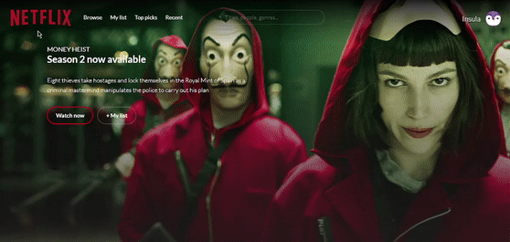

# Netflix-UI
Simple Netflix user interface created using HTML, SCSS, and Babel JS

Uses the <a href="https://developers.themoviedb.org/">Movie Database API</a> to fetch Netflix movie/show information then output it to the user.
